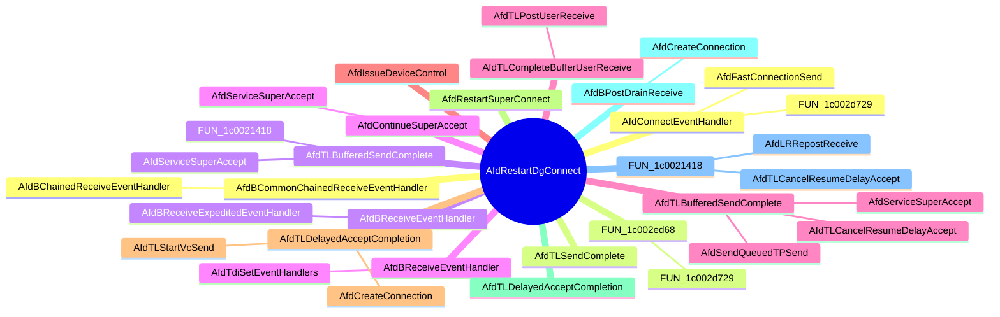

# Ghidrecomp - Command Line Ghidra Decompiler 

<p align="center">


</p>

## About

This Python command line tool decompiles all functions of a binary and writes them to a directory in separate `C` files:


Or a single file `C` and header file with `--cppexport`:


The main purpose for this is to use the decomplilations for research and analysis. The tool relies on [Ghidra](https://ghidra-sre.org/) for decompilation and communicates to Ghidra with `jpype` via `pyhidra`.

## TOC

- [Ghidrecomp - Command Line Ghidra Decompiler](#ghidrecomp---command-line-ghidra-decompiler)
  - [About](#about)
  - [TOC](#toc)
  - [Features](#features)
  - [Usage](#usage)
  - [Example Usage with Windows afd.sys:](#example-usage-with-windows-afdsys)
    - [Command line](#command-line)
    - [Output](#output)
    - [Decompilation Output Dir](#decompilation-output-dir)
  - [Example usage in Docker container](#example-usage-in-docker-container)
    - [Command (Host)](#command-host)
    - [Or pull from docker registry](#or-pull-from-docker-registry)
    - [Command (in container)](#command-in-container)
    - [Output](#output-1)
    - [Decompilation Output Dir](#decompilation-output-dir-1)
  - [Example Usage with Windows afd.sys Callgraph:](#example-usage-with-windows-afdsys-callgraph)
    - [Command line](#command-line-1)
    - [Output](#output-2)
    - [Sample Calling Callgraph Output AfdRestartDgConnect:](#sample-calling-callgraph-output-afdrestartdgconnect)
    - [Sample MindMap Output for AfdRestartDgConnect](#sample-mindmap-output-for-afdrestartdgconnect)
  - [Installation](#installation)
    - [Windows](#windows)
    - [Linux / Mac](#linux--mac)
    - [Devcontainer / Docker](#devcontainer--docker)
      - [Option 1 - Devcontainer](#option-1---devcontainer)
      - [Option 2 - Docker](#option-2---docker)


## Features
*all these features are ultimately provided by Ghidra*

- Decompile all the functions (threaded)
  - to a folder (`-o OUTPUT_PATH`)
  - to a single c file and header file (`--cppexport`)
- Auto-downloaded symbols for supported symbol servers (`-s SYMBOLS_PATH`)
  - https://msdl.microsoft.com/download/symbols/
  - https://chromium-browser-symsrv.commondatastorage.googleapis.com/
  - https://symbols.mozilla.org/
  - https://software.intel.com/sites/downloads/symbols/
  - https://driver-symbols.nvidia.com/
  - https://download.amd.com/dir/bin/
- Specify the pdb for the binary (`--sym-file-path`)
- Filter functions to decompile that match regex (`--filter`)
- Apply custom data types (`--gdt`)

## Usage

```
usage: ghidrecomp [-h] [--cppexport] [--filter FILTERS] [--project-path PROJECT_PATH] [--gdt [GDT]] [-o OUTPUT_PATH] [-v] [--skip-cache] [--sym-file-path SYM_FILE_PATH | -s SYMBOLS_PATH | --skip-symbols]
                  [-t THREAD_COUNT] [--va] [--fa] [--max-ram-percent MAX_RAM_PERCENT] [--print-flags] [--callgraphs] [--callgraph-filter CALLGRAPH_FILTER] [--mdd MAX_DISPLAY_DEPTH] [--max-time-cg-gen MAX_TIME_CG_GEN]
                  [--cg-direction {calling,called,both}]
                  bin

ghidrecomp - A Command Line Ghidra Decompiler

positional arguments:
  bin                   Path to binary used for analysis

options:
  -h, --help            show this help message and exit
  --cppexport           Use Ghidras CppExporter to decompile to single file (default: False)
  --filter FILTERS      Regex match for function name (default: None)
  --project-path PROJECT_PATH
                        Path to base ghidra projects (default: .ghidra_projects)
  --gdt [GDT]           Additional GDT to apply (default: None)
  -o OUTPUT_PATH, --output-path OUTPUT_PATH
                        Location for all decompilations (default: decompilations)
  -v, --version         show program's version number and exit
  --skip-cache          Skip cached and genearate new decomp and callgraphs. (default: False)
  --sym-file-path SYM_FILE_PATH
                        Specify single pdb symbol file for bin (default: None)
  -s SYMBOLS_PATH, --symbols-path SYMBOLS_PATH
                        Path for local symbols directory (default: .symbols)
  --skip-symbols        Do not apply symbols (default: False)
  -t THREAD_COUNT, --thread-count THREAD_COUNT
                        Threads to use for processing. Defaults to cpu count (default: 8)
  --va                  Enable verbose analysis (default: False)
  --fa                  Force new analysis (even if already analyzed) (default: False)

JVM Options:
  --max-ram-percent MAX_RAM_PERCENT
                        Set JVM Max Ram % of host RAM (default: 50.0)
  --print-flags         Print JVM flags at start (default: False)

Callgraph Options:
  --callgraphs          Generate callgraph markdown (default: False)
  --callgraph-filter CALLGRAPH_FILTER
                        Only generate callgraphs for functions matching filter (default: .)
  --mdd MAX_DISPLAY_DEPTH, --max-display-depth MAX_DISPLAY_DEPTH
                        Max Depth for graph generation (default: None)
  --max-time-cg-gen MAX_TIME_CG_GEN
                        Max time in seconds to wait for callgraph gen. (default: 5)
  --cg-direction {calling,called,both}
                        Direction for callgraph. (default: calling)
```


## Example Usage with Windows afd.sys:

### Command line
```bash
wget https://msdl.microsoft.com/download/symbols/afd.sys/50989142a9000/afd.sys -O afd.sys.10.0.22621.1415
ghidrecomp afd.sys.10.0.22621.1415
```

### Output
```bash
Starting decompliations: Namespace(bin='tests/data/afd.sys.10.0.22621.1344', cppexport=False, filters=None, project_path='.ghidra_projects', output_path='decompilations', sym_file_path=None, symbols_path='.symbols', skip_symbols=False, thread_count=8, va=False)
INFO  Using log config file: jar:file:/ghidra/Ghidra/Framework/Generic/lib/Generic.jar!/generic.log4j.xml (LoggingInitialization)  
INFO  Using log file: /home/vscode/.ghidra/.ghidra_10.2.3_PUBLIC/application.log (LoggingInitialization)  
INFO  Loading user preferences: /home/vscode/.ghidra/.ghidra_10.2.3_PUBLIC/preferences (Preferences)  
INFO  Class search complete (766 ms) (ClassSearcher)  
INFO  Initializing SSL Context (SSLContextInitializer)  
INFO  Initializing Random Number Generator... (SecureRandomFactory)  
INFO  Random Number Generator initialization complete: NativePRNGNonBlocking (SecureRandomFactory)  
INFO  Trust manager disabled, cacerts have not been set (ApplicationTrustManagerFactory)  
INFO  Creating project: /workspaces/ghidrecomp/.ghidra_projects/afd.sys.10.0.22621.1344/afd.sys.10.0.22621.1344 (DefaultProject)  
INFO  Using Loader: Portable Executable (PE) (AutoImporter)  
Setting up Symbol Server for symbols...
path: .symbols level: 1
Loaded well known /ghidra/Ghidra/Configurations/Public_Release/data/PDB_SYMBOL_SERVER_URLS.pdburl' length: 883'
Symbol Server Configured path: SymbolServerService:
        symbolStore: LocalSymbolStore: [ rootDir: /workspaces/ghidrecomp/.symbols, storageLevel: -1],
        symbolServers:
                HttpSymbolServer: [ url: https://msdl.microsoft.com/download/symbols/, storageLevel: -1]
                HttpSymbolServer: [ url: https://chromium-browser-symsrv.commondatastorage.googleapis.com/, storageLevel: -1]
                HttpSymbolServer: [ url: https://symbols.mozilla.org/, storageLevel: -1]
                HttpSymbolServer: [ url: https://software.intel.com/sites/downloads/symbols/, storageLevel: -1]
                HttpSymbolServer: [ url: https://driver-symbols.nvidia.com/, storageLevel: -1]
                HttpSymbolServer: [ url: https://download.amd.com/dir/bin/, storageLevel: -1]
Analyzing program afd.sys.10.0.22621.1344
INFO  PDB analyzer parsing file: /workspaces/ghidrecomp/.symbols/afd.pdb/14FBAE3662AD9F7B9D33AA9228D2554A1/afd.pdb (PdbUniversalAnalyzer)  
INFO  Resolve time: 0 mS (DefaultPdbApplicator)  
INFO  resolveCount: 0 (DefaultPdbApplicator)  
INFO  PDB Terminated Normally (DefaultPdbApplicator)  
WARN  Decompiling 1c0001340, pcode error at 1c000000c: Unable to resolve constructor at 1c000000c (DecompileCallback)  
INFO  Packed database cache: /tmp/vscode-Ghidra/packed-db-cache (PackedDatabaseCache)  
WARN  Decompiling 1c0001340, pcode error at 1c000000c: Unable to resolve constructor at 1c000000c (DecompileCallback)  
INFO  -----------------------------------------------------
    ASCII Strings                              0.343 secs
    Apply Data Archives                        0.548 secs
    Call Convention ID                         0.025 secs
    Call-Fixup Installer                       0.013 secs
    Create Address Tables                      0.039 secs
    Create Address Tables - One Time           0.076 secs
    Create Function                            0.232 secs
    Data Reference                             0.126 secs
    Decompiler Parameter ID                   10.939 secs
    Decompiler Switch Analysis                 0.442 secs
    Demangler Microsoft                        0.089 secs
    Disassemble                                0.007 secs
    Disassemble Entry Points                   1.959 secs
    Disassemble Entry Points - One Time        0.005 secs
    Embedded Media                             0.020 secs
    External Entry References                  0.000 secs
    Function ID                                0.805 secs
    Function Start Search                      0.038 secs
    Non-Returning Functions - Discovered       0.132 secs
    Non-Returning Functions - Known            0.012 secs
    PDB Universal                              2.810 secs
    Reference                                  0.104 secs
    Scalar Operand References                  0.601 secs
    Shared Return Calls                        0.219 secs
    Stack                                      5.164 secs
    Subroutine References                      0.113 secs
    Subroutine References - One Time           0.026 secs
    Windows x86 PE Exception Handling          0.027 secs
    Windows x86 PE RTTI Analyzer               0.005 secs
    Windows x86 Thread Environment Block (TEB) Analyzer     0.038 secs
    WindowsResourceReference                   0.124 secs
    x86 Constant Reference Analyzer            5.755 secs
-----------------------------------------------------
     Total Time   30 secs
-----------------------------------------------------
 (AutoAnalysisManager)  
Decompiling 1275 functions using 8 threads
Setup 8 decompliers
WARN  Decompiling 1c0001340, pcode error at 1c000000c: Unable to resolve constructor at 1c000000c (DecompileCallback)  
Completed 100 and 7%
Completed 200 and 15%
Completed 300 and 23%
Completed 400 and 31%
Completed 500 and 39%
Completed 600 and 47%
Completed 700 and 54%
Completed 800 and 62%
Completed 900 and 70%
Completed 1000 and 78%
Completed 1100 and 86%
Completed 1200 and 94%
Decompiled 1275 functions for afd.sys.10.0.22621.1344 in 13.469883680343628
Wrote 1275 decompilations for afd.sys.10.0.22621.1344 to decompilations/afd.sys.10.0.22621.1344 in 3.174959659576416
```

### Decompilation Output Dir
```bash
$ tree decompilations | more
decompilations
└── afd.sys
    ├── AFDETW_TRACEDATA_INDICATION-1c0008d00.c
    ├── AFDETW_TRACEDISCONNECT-1c000f884.c
    ├── AFDETW_TRACELISTEN-1c0016778.c
    ├── AFDETW_TRACEOPTION-1c0012660.c
    ├── AFDETW_TRACERECV-1c0001e38.c
    ├── AFDETW_TRACERECVDATAGRAM-1c0009ef0.c
    ├── AFDETW_TRACESEND-1c000d19c.c
    ├── AFDETW_TRACESENDDATAGRAM-1c0007d10.c
    ├── AFDETW_TRACESENDMSG-1c0015afc.c
    ├── AFDETW_TRACESENDTO-1c00162dc.c
    ├── AFDETW_TRACESTATUS-1c00204d2.c
    ├── AFDETW_TRACETRANSFER-1c004189c.c
    ├── AFDETW_TRACEWAITLISTEN-1c0013674.c
    ├── AFD_PCW_INCREMENT_DROPPED_DATAGRAMS-1c00208e4.c
    ├── AFD_PCW_INCREMENT_REJECTED_CONNECTIONS-1c0032aa4.c
    ├── AfdAbortConnection-1c0033ec4.c
    ├── AfdAbortTPackets-1c003d5ec.c
    ├── AfdAccept-1c0018300.c
    ├── AfdAcceptCore-1c00187d8.c
    ├── AfdAcquireReadLock-1c0020b54.c
    ├── AfdAcquireReadLockAtDpcLevel-1c000b0f4.c
    ├── AfdAcquireWriteLock-1c001b8ac.c
    ├── AfdAddAddressHandler-1c00662f0.c
    ├── AfdAddConnectedReference-1c000f334.c
    ├── AfdAddConnectionToTimerWheel-1c0036520.c
    ├── AfdAddFreeConnection-1c006d7cc.c
    ├── AfdAddressListChange$filt$0-1c001dcb7.c
    ├── AfdAddressListChange$filt$1-1c001dce0.c    
    ├── AfdBuildSendMsgTracker-1c00682ac.c
... several lines omitted
 ```

 ```bash
 $ cat decompilations/afd.sys.10.0.22621.1415/AfdGetRemoteAddress-1c0065500.c 
```

```c
void AfdGetRemoteAddress(longlong param_1,undefined8 param_2,char param_3,undefined8 param_4,
                        undefined8 param_5,void *param_6,uint param_7,ulonglong *param_8)

{
  ushort uVar1;
  short *psVar2;
  uint uVar3;
  ulonglong uVar4;
  undefined uVar5;
  void *_Src;
  undefined8 unaff_RBX;
  undefined8 unaff_RSI;
  undefined unaff_DIL;
  char cVar7;
  ulonglong _Size;
  undefined unaff_R14B;
  undefined unaff_R15B;
  undefined unaff_retaddr;
  undefined uVar8;
  short *psVar9;
  undefined in_stack_ffffffffffffffe0;
  short *psVar6;
  
  psVar2 = *(short **)(param_1 + 0x18);
  *param_8 = 0;
  psVar6 = psVar2;
  cVar7 = param_3;
  psVar9 = psVar2;
  uVar4 = AfdLockEndpointContext((longlong)psVar2);
  uVar5 = SUB81(psVar6,0);
  uVar8 = SUB81(psVar9,0);
  if (((uVar4 != 0) && (*psVar2 == -0x502e)) && (*(char *)(psVar2 + 1) == '\x04')) {
    uVar1 = psVar2[0x5d];
    uVar5 = (undefined)uVar1;
    uVar3 = (uint)(ushort)psVar2[0x5c] + (uint)uVar1;
    if (uVar3 < *(uint *)(psVar2 + 0x74) || uVar3 == *(uint *)(psVar2 + 0x74)) {
      if (uVar1 <= param_7) {
        if (param_3 != '\0') {
          ProbeForWrite(param_6,uVar1,1);
        }
        _Size = (ulonglong)(ushort)psVar2[0x5d];
        _Src = (void *)((ushort)psVar2[0x5c] + uVar4);
        memcpy(param_6,_Src,_Size);
        *param_8 = (ulonglong)*(uint *)(psVar2 + 0x74);
        FUN_1c00655e1((char)param_6,(char)_Src,(char)_Size,(undefined)param_4,
                      in_stack_ffffffffffffffe0,unaff_R15B,unaff_R14B,unaff_DIL,unaff_retaddr,uVar8,
                      unaff_RBX,unaff_RSI);
        return;
      }
      FUN_1c00655e1(uVar5,(undefined)param_2,cVar7,(undefined)param_4,in_stack_ffffffffffffffe0,
                    unaff_R15B,unaff_R14B,unaff_DIL,unaff_retaddr,uVar8,unaff_RBX,unaff_RSI);
      return;
    }
  }
  FUN_1c00655e1(uVar5,(undefined)param_2,cVar7,(undefined)param_4,in_stack_ffffffffffffffe0,
                unaff_R15B,unaff_R14B,unaff_DIL,unaff_retaddr,uVar8,unaff_RBX,unaff_RSI);
  return;
}
```

## Example usage in Docker container


### Command (Host)
```bash
$ docker run --rm -it ghcr.io/clearbluejar/ghidrecomp:latest bash
Unable to find image 'ghcr.io/clearbluejar/ghidrecomp:latest' locally
latest: Pulling from clearbluejar/ghidrecomp
32fb02163b6b: Pull complete
167c7feebee8: Pull complete
d6dfff1f6f3d: Pull complete
e9cdcd4942eb: Pull complete
ca3bce705f6c: Pull complete
5e1c6c4f8bbf: Pull complete
e7e563b10921: Pull complete
9eb9d866c104: Pull complete
8ca602e7301a: Pull complete
124a51dde68b: Pull complete
c04919d34655: Pull complete
a2570739af5d: Pull complete
e57c67fabbc5: Pull complete
8da6a860f9e3: Pull complete
ca6008c09918: Pull complete
702a3b20cdb3: Pull complete
bd0b7bd152dc: Pull complete
7299f2e2483b: Pull complete
4f4fb700ef54: Pull complete
7cbbb1896fad: Pull complete
1f309d93fb79: Pull complete
d11b50be43c4: Pull complete
7c66f674c44d: Pull complete
8497280f5c51: Pull complete
Digest: sha256:4e42285dc1d71c849b7c89fae6598691bdc7d0ee9ec55eb70ce00b5c722fba59
Status: Downloaded newer image for ghcr.io/clearbluejar/ghidrecomp:latest
```

### Or pull from docker registry
```bash
docker pull 
$ docker run --rm -it clearbluejar/ghidrecomp:latest bash
```

### Command (in container)
```bash
vscode ➜ /tmp $ ghidrecomp /bin/ls
```

### Output
```bash
Starting decompliations: Namespace(bin='/bin/ls', cppexport=False, filters=None, project_path='.ghidra_projects', output_path='decompilations', sym_file_path=None, symbols_path='.symbols', skip_symbols=False, thread_count=12, va=False)
INFO  Using log config file: jar:file:/ghidra/Ghidra/Framework/Generic/lib/Generic.jar!/generic.log4j.xml (LoggingInitialization)
INFO  Using log file: /home/vscode/.ghidra/.ghidra_10.2.3_PUBLIC/application.log (LoggingInitialization)
INFO  Loading user preferences: /home/vscode/.ghidra/.ghidra_10.2.3_PUBLIC/preferences (Preferences)
INFO  Class search complete (898 ms) (ClassSearcher)
INFO  Initializing SSL Context (SSLContextInitializer)
INFO  Initializing Random Number Generator... (SecureRandomFactory)
INFO  Random Number Generator initialization complete: NativePRNGNonBlocking (SecureRandomFactory)
INFO  Trust manager disabled, cacerts have not been set (ApplicationTrustManagerFactory)
INFO  Creating project: /tmp/.ghidra_projects/ls/ls (DefaultProject)
INFO  Starting cache cleanup: /tmp/vscode-Ghidra/fscache2 (FileCacheMaintenanceDaemon)
INFO  Finished cache cleanup, estimated storage used: 0 (FileCacheMaintenanceDaemon)
INFO  Using Loader: Executable and Linking Format (ELF) (AutoImporter)
Setting up Symbol Server for symbols...
path: .symbols level: 1
Loaded well known /ghidra/Ghidra/Configurations/Public_Release/data/PDB_SYMBOL_SERVER_URLS.pdburl' length: 883'
Symbol Server Configured path: SymbolServerService:
        symbolStore: LocalSymbolStore: [ rootDir: /tmp/.symbols, storageLevel: -1],
        symbolServers:
                HttpSymbolServer: [ url: https://msdl.microsoft.com/download/symbols/, storageLevel: -1]
                HttpSymbolServer: [ url: https://chromium-browser-symsrv.commondatastorage.googleapis.com/, storageLevel: -1]
                HttpSymbolServer: [ url: https://symbols.mozilla.org/, storageLevel: -1]
                HttpSymbolServer: [ url: https://software.intel.com/sites/downloads/symbols/, storageLevel: -1]
                HttpSymbolServer: [ url: https://driver-symbols.nvidia.com/, storageLevel: -1]
                HttpSymbolServer: [ url: https://download.amd.com/dir/bin/, storageLevel: -1]
Analyzing program ls
INFO  DWARF external debug information found: ExternalDebugInfo [filename=61a544c35b9dc1d172d1a1c09043e487326966.debug, crc=d165fd8a, hash=6461a544c35b9dc1d172d1a1c09043e487326966] (ExternalDebugFilesService)
INFO  Unable to find DWARF information, skipping DWARF analysis (DWARFAnalyzer)
INFO  hit non-returning function, restarting decompiler switch analyzer later (DecompilerSwitchAnalyzer)
INFO  Packed database cache: /tmp/vscode-Ghidra/packed-db-cache (PackedDatabaseCache)
INFO  -----------------------------------------------------
    ASCII Strings                              0.565 secs
    Apply Data Archives                        0.462 secs
    Call Convention ID                         0.013 secs
    Call-Fixup Installer                       0.009 secs
    Create Address Tables                      0.077 secs
    Create Address Tables - One Time           0.025 secs
    Create Function                            0.036 secs
    DWARF                                      0.011 secs
    Data Reference                             0.054 secs
    Decompiler Switch Analysis                 0.136 secs
    Decompiler Switch Analysis - One Time      2.743 secs
    Demangler GNU                              0.044 secs
    Disassemble Entry Points                   1.104 secs
    ELF Scalar Operand References              0.285 secs
    Embedded Media                             0.011 secs
    External Entry References                  0.000 secs
    Function ID                                0.225 secs
    Function Start Search                      0.033 secs
    Function Start Search After Code           0.012 secs
    Function Start Search After Data           0.012 secs
    GCC Exception Handlers                     0.319 secs
    Non-Returning Functions - Discovered       0.189 secs
    Non-Returning Functions - Known            0.005 secs
    Reference                                  0.129 secs
    Shared Return Calls                        0.092 secs
    Stack                                      1.734 secs
    Subroutine References                      0.048 secs
    Subroutine References - One Time           0.000 secs
    x86 Constant Reference Analyzer            2.017 secs
-----------------------------------------------------
     Total Time   10 secs
-----------------------------------------------------
 (AutoAnalysisManager)
Skipped 0 functions that failed to match any of None
Decompiling 520 functions using 12 threads
Setup 12 decompliers
Completed 100 and 19%
Completed 200 and 38%
Completed 300 and 57%
WARN  Decompiling 00126010, pcode error at 00126010: Unable to disassemble EXTERNAL block location: 00126010 (DecompileCallback)

Decompiled 520 functions for ls in 5.361317157745361
Wrote 520 decompilations for ls to decompilations/ls in 0.1671760082244873
```


### Decompilation Output Dir

```bash
vscode ➜ /tmp $ tree decompilations
decompilations
└── ls
    ├── _ITM_deregisterTMCloneTable-00134078.c
    ├── _ITM_registerTMCloneTable-00134358.c
    ├── __DT_FINI-00118930.c
    ├── __DT_INIT-00103730.c
    ├── __assert_fail-00103da0.c
    ├── __assert_fail-00134370.c
    ├── __ctype_b_loc-00103c00.c
    ├── __ctype_b_loc-00134288.c
    ├── __libc_start_main-00134190.c
    ├── __lxstat-00103ce0.c
    ├── __lxstat-001342f8.c
    ├── exit-00134050.c
    ├── fclose-00103990.c
    ├── fclose-00134138.c
    ├── fflush-00103ca0.c
    ├── fflush-001342d8.c
    ├── fflush_unlocked-00103c90.c
    ├── fflush_unlocked-001342d0.c
    ├── fgetfilecon-001037a0.c
    ├── fgetfilecon-00134018.c
    ├── fileno-00103950.c
    ├── fileno-00134110.c
    ├── fnmatch-00103c80.c
    ├── fnmatch-001342c8.c
    ├── fputc_unlocked-00103d20.c
    ├── fputc_unlocked-00134320.c
    ├── fputs_unlocked-00103d40.c
... several more omitted
```

```bash
 cat decompilations/ls/FUN_0010eb20-0010eb20.c
```
```c
void * FUN_0010eb20(void *param_1,char *param_2,void **param_3)

{
  size_t __n;
  long lVar1;
  long lVar2;
  size_t __n_00;
  void *__dest;
  undefined *puVar3;
  ulong uVar4;
  undefined local_41;

  lVar1 = FUN_0010e740();
  lVar2 = FUN_0010e7a0(lVar1);
  __n = (lVar1 - (long)param_1) + lVar2;
  __n_00 = strlen(param_2);
  if (lVar2 == 0) {
    local_41 = 0x2e;
    if (*param_2 != '/') {
      local_41 = 0;
    }
    uVar4 = (ulong)(*param_2 == '/');
  }
  else if (*(char *)((long)param_1 + (__n - 1)) == '/') {
    local_41 = 0;
    uVar4 = 0;
  }
  else {
    local_41 = 0x2f;
    if (*param_2 == '/') {
      local_41 = 0;
    }
    uVar4 = (ulong)(*param_2 != '/');
  }
  __dest = malloc(__n + 1 + __n_00 + uVar4);
  if (__dest != (void *)0x0) {
    puVar3 = (undefined *)mempcpy(__dest,param_1,__n);
    *puVar3 = local_41;
    if (param_3 != (void **)0x0) {
      *param_3 = puVar3 + uVar4;
    }
    puVar3 = (undefined *)mempcpy(puVar3 + uVar4,param_2,__n_00);
    *puVar3 = 0;
  }
  return __dest;
}
```

## Example Usage with Windows afd.sys Callgraph:

### Command line

Generate a decompilation and callgraph of all functions matching the function `--filter AfdRestart` and `--callgraph-filter AfdRestart`. 

```bash
ghidrecomp tests/data/afd.sys.10.0.22621.1415 --callgraph-filter AfdRestart --filter AfdRestart --callgraphs
```

### Output

```bash
Starting decompliations: Namespace(bin='tests/data/afd.sys.10.0.22621.1415', cppexport=False, filters=['AfdRestart'], project_path='.ghidra_projects', gdt=None, output_path='decompilations', skip_cache=True, sym_file_path=None, symbols_path='.symbols', skip_symbols=False, thread_count=8, va=False, fa=False, max_ram_percent=50.0, print_flags=False, callgraphs=True, callgraph_filter='AfdRestart', max_display_depth=None, max_time_cg_gen=5, cg_direction='calling')
INFO  Using log config file: jar:file:/ghidra/Ghidra/Framework/Generic/lib/Generic.jar!/generic.log4j.xml (LoggingInitialization)  
INFO  Using log file: /home/vscode/.ghidra/.ghidra_10.3_PUBLIC/application.log (LoggingInitialization)  
INFO  Loading user preferences: /home/vscode/.ghidra/.ghidra_10.3_PUBLIC/preferences (Preferences)  
INFO  Searching for classes... (ClassSearcher)  
INFO  Class search complete (710 ms) (ClassSearcher)  
INFO  Initializing SSL Context (SSLContextInitializer)  
INFO  Initializing Random Number Generator... (SecureRandomFactory)  
INFO  Random Number Generator initialization complete: NativePRNGNonBlocking (SecureRandomFactory)  
INFO  Trust manager disabled, cacerts have not been set (ApplicationTrustManagerFactory)  
INFO  Opening project: /workspaces/ghidrecomp/.ghidra_projects/afd.sys.10.0.22621.1415/afd.sys.10.0.22621.1415 (DefaultProject)  
Setting up Symbol Server for symbols...
path: .symbols level: 1
Loaded well known /ghidra/Ghidra/Configurations/Public_Release/data/PDB_SYMBOL_SERVER_URLS.pdburl' length: 883'
Symbol Server Configured path: SymbolServerService:
        symbolStore: LocalSymbolStore: [ rootDir: /workspaces/ghidrecomp/.symbols, storageLevel: -1],
        symbolServers:
                HttpSymbolServer: [ url: https://msdl.microsoft.com/download/symbols/, storageLevel: -1]
                HttpSymbolServer: [ url: https://chromium-browser-symsrv.commondatastorage.googleapis.com/, storageLevel: -1]
                HttpSymbolServer: [ url: https://symbols.mozilla.org/, storageLevel: -1]
                HttpSymbolServer: [ url: https://software.intel.com/sites/downloads/symbols/, storageLevel: -1]
                HttpSymbolServer: [ url: https://driver-symbols.nvidia.com/, storageLevel: -1]
                HttpSymbolServer: [ url: https://download.amd.com/dir/bin/, storageLevel: -1]
Using file gdts: [windows_vs12_64]
afd.sys.10.0.22621.1415 - .ProgramDB already analyzed... skipping
INFO  Opening project: /workspaces/ghidrecomp/.ghidra_projects/afd.sys.10.0.22621.1415/afd.sys.10.0.22621.1415 (DefaultProject)  
Skipped 1241 functions that failed to match any of ['AfdRestart']
Decompiling 34 functions using 8 threads
Setup 8 decompliers
Decompiled 34 functions for afd.sys.10.0.22621.1415 in 0.8643746376037598
0 decompilations already existed.
Wrote 34 decompilations for afd.sys.10.0.22621.1415 to decompilations/afd.sys.10.0.22621.1415 in 0.0516660213470459

Error: time expired for AfdLRRepostReceive func: AfdRestartBufferSend. max_run_time: 5 Increase timeout with --max-time-cg-gen MAX_TIME_CG_GEN

Error: time expired for AfdReuseConnection func: AfdRestartDeviceControl. max_run_time: 5 Increase timeout with --max-time-cg-gen MAX_TIME_CG_GEN

Error: time expired for AfdConnect func: AfdRestartSend. max_run_time: 5 Increase timeout with --max-time-cg-gen MAX_TIME_CG_GEN

Error: time expired for WskProControlSocketCore func: AfdRestartAbort. max_run_time: 5 Increase timeout with --max-time-cg-gen MAX_TIME_CG_GEN

Error: time expired for WskProIRPControlSocket func: AfdRestartDelayedAcceptListen. max_run_time: 5 Increase timeout with --max-time-cg-gen MAX_TIME_CG_GEN

Error: time expired for AfdSanAcceptCore func: AfdRestartDisconnect. max_run_time: 5 Increase timeout with --max-time-cg-gen MAX_TIME_CG_GEN

Error: time expired for AfdTPacketsBufferRead func: AfdRestartMdlReadComplete. max_run_time: 5 Increase timeout with --max-time-cg-gen MAX_TIME_CG_GEN

Error: time expired for AfdSanAcceptCore func: AfdRestartTPDetachedSend. max_run_time: 5 Increase timeout with --max-time-cg-gen MAX_TIME_CG_GEN

Error: time expired for AfdTLBindSecurityComplete func: AfdRestartTPacketsBufferRead. max_run_time: 5 Increase timeout with --max-time-cg-gen MAX_TIME_CG_GEN

Error: time expired for FUN_1c0023892 func: AfdRestartTPacketsMdlRead. max_run_time: 5 Increase timeout with --max-time-cg-gen MAX_TIME_CG_GEN

Error: time expired for WskProIRPControlSocket func: AfdRestartTPacketsSend. max_run_time: 5 Increase timeout with --max-time-cg-gen MAX_TIME_CG_GEN
Callgraphed 34 functions for afd.sys.10.0.22621.1415 in 10.055054426193237
Wrote 34 callgraphs for afd.sys.10.0.22621.1415 to decompilations/afd.sys.10.0.22621.1415/callgraphs in 10.055152416229248
0 callgraphs already existed.

```

### Sample Calling Callgraph Output AfdRestartDgConnect:

```mermaid
flowchart TD
classDef sh fill:#339933
0["AfdRestartBufferReceiveWithUserIrp"] --> 1["AfdLRRepostReceive"]
0 --> 2["AfdTLPostPendedReceives"]
3["AfdRestartSuperAccept"] --> 4["AfdContinueSuperAccept"]
5["AfdRestartAccept"] --> 6["AfdServiceSuperAccept"]
7["AfdIssueDeviceControl"] --> 8["AfdRestartDeviceControl"]
9["AfdBCommonChainedReceiveEventHandler"] --> 0
9 --> 10["AfdCommonRestartBufferReceive"]
9 --> 11["FUN_1c0008952"]
12["AfdTLConnectedReceiveEventHandler"]:::sh --> 9
13["AfdBChainedReceiveEventHandler"] --> 9
14["AfdTdiSetEventHandlers"] --> 13
14 --> 15["AfdBReceiveExpeditedEventHandler"]
14 --> 16["AfdBReceiveEventHandler"]
17["AfdRestartBufferReceive"] --> 10
18["AfdBind"]:::sh --> 14
18:::sh --> 19["AfdCreateConnection"]
18:::sh --> 20["AfdTLBindSecurity"]
18:::sh --> 21["AfdRestartBindGetAddress"]
22["AfdRestartSend"] --> 22
23["AfdTLSendComplete"] --> 22
24["AfdTLStartVcSend"] --> 23
25["AfdTLConnectEventHandler"]:::sh --> 3
25:::sh --> 26["AfdTLDelayedAcceptCompletion"]
25:::sh --> 5
16 --> 0
16 --> 1
16 --> 17
27["AfdAccept"]:::sh --> 28["AfdRestartDelayedAccept"]
27:::sh --> 29["AfdTLCancelResumeDelayAccept"] 
26 --> 28
26 --> 30["AfdRestartDelayedSuperAccept"]
15 --> 16
31["AfdTLCompleteBufferUserReceive"] --> 0
32["AfdTLPostUserReceive"] --> 31
2 --> 32
10 --> 2
10 --> 1
19 --> 7
33["AfdBPostDrainReceive"] --> 17
33 --> 34["AfdTLCompleteBufferReceive"]
33 --> 10
35["AfdRestartSuperConnect"] --> 36["AfdRestartBufferSend"]
37["AfdConnectEventHandler"] --> 3
37 --> 5
38["FUN_1c000e1aa"] --> 19
38 --> 39["AfdDoDatagramConnect"]
40["AfdSendQueuedTPSend"] --> 24
40 --> 41["AfdTLBufferedSendComplete"]
42["AfdConnect"]:::sh --> 38
43["AfdSuperConnect"]:::sh --> 35
43:::sh --> 41
44["AfdTLAbortEventHandler"]:::sh --> 26
29 --> 26
1 --> 33
1 --> 0
45["AfdCompleteTPackets"] --> 40
45 --> 46["AfdTPacketsWorker"]
45 --> 47["AfdStartNextQueuedTransmit"]
48["FUN_1c0027fa2"] --> 19
49["FUN_1c0021418"] --> 36
49 --> 41
50["AfdFastConnectionSend"] --> 49
51["AfdBInitDrainBytesInTransport"] --> 1
52["FUN_1c002246f"] --> 51
52 --> 53["FUN_1c0004001"]
54["FUN_1c002ed68"] --> 29
54 --> 30
54 --> 54
54 --> 55["AfdRestartSuperAcceptListen"]
56["FUN_1c002d729"] --> 37
57["AfdTLBindComplete2"] --> 48
58["AfdRestartTPacketsMdlRead"] --> 45
58 --> 46
58 --> 59["AfdTPacketsContinueAfterRead"]
60["AfdTLDgramBindComplete"] --> 57
61["AfdFastIoDeviceControl"]:::sh --> 50
62["AfdTLBindComplete"] --> 60
62 --> 63["FUN_1c0027f76"]
62 --> 57
64["AfdTLBind"] --> 62
65["AfdTLBindSecurityComplete"] --> 64
65 --> 20
65 --> 57
20 --> 65
20 --> 64
63 --> 60
66["AfdBReceive"] --> 52
66 --> 67["FUN_1c0022408"]
68["AfdStartListen"]:::sh --> 56
69["AfdTPacketsMdlRead"] --> 58
69 --> 59
30 --> 4
6 --> 54
70["AfdFastIoWrite"]:::sh --> 50
41 --> 36
71["FUN_1c002ec66"] --> 6
71 --> 71
71 --> 72["AfdCloseConnection"]
46 --> 69
46 --> 46
46 --> 73["AfdTPacketsSend"]
46 --> 74["AfdTPacketsBufferRead"]
46 --> 75["AfdStartNextTPacketsIrp"]
76["AfdRestartSuperAcceptGetAddress"] --> 4
34 --> 10
4 --> 76
4 --> 77["AfdRestartSuperAcceptReceive"]
55 --> 4
78["AfdReceive"] --> 66
79["AfdCommonRestartTPacketsSend"] --> 46
79 --> 73
80["AfdTLRestartTPacketsSend"] --> 79
81["AfdTLTPacketsSend"] --> 80
82["AfdDispatch"] --> 78
83["DriverEntry"] --> 82
73 --> 81
73 --> 84["AfdRestartTPacketsSend"]
73 --> 75
85["AfdSanConnectHandler"]:::sh --> 6
86["FUN_1c00128c9"] --> 6
87["AfdSuperAccept"]:::sh --> 86
88["entry"]:::sh --> 83
59 --> 73
74 --> 59
74 --> 89["AfdRestartTPacketsBufferRead"]
89 --> 59
89 --> 46
90["FUN_1c0023892"] --> 51
90 --> 90
90 --> 33
91["AfdGetAddress"]:::sh --> 92["AfdRestartGetAddress"]
84 --> 79
75 --> 46
47 --> 46
93["AfdCompleteClosePendedTPackets"] --> 47
11 --> 1
94["AfdFreeNPConnectionResources"] --> 93
95["AfdFreeConnectionResources"] --> 94
96["AfdFreeConnectionEx"] --> 95
72 --> 96
97["AfdReturnNicsPackets"]:::sh --> 72
53 --> 32
67 --> 33
39 --> 98["AfdRestartDgConnect"]

```



### Sample MindMap Output for AfdRestartDgConnect




## Installation

1. [Download](https://github.com/NationalSecurityAgency/ghidra/releases) and [install Ghidra](https://htmlpreview.github.io/?https://github.com/NationalSecurityAgency/ghidra/blob/stable/GhidraDocs/InstallationGuide.html#Install) and [Java](https://htmlpreview.github.io/?https://github.com/NationalSecurityAgency/ghidra/blob/stable/GhidraDocs/InstallationGuide.html#JavaNotes) required for Ghidra.
2. Set Ghidra Environment Variable `GHIDRA_INSTALL_DIR` to Ghidra install location.
3. Pip install `ghidrecomp`

### Windows

```powershell
PS C:\Users\user> [System.Environment]::SetEnvironmentVariable('GHIDRA_INSTALL_DIR','C:\ghidra_10.2.3_PUBLIC_20230208\ghidra_10.2.3_PUBLIC')
PS C:\Users\user> pip install ghidrecomp
```
### Linux / Mac

```bash
export GHIDRA_INSTALL_DIR="/path/to/ghidra/"
pip install ghidrecomp
```

### Devcontainer / Docker

Avoid installing Ghidra and Java on your host by using a **devcontainer**. 

#### Option 1 - Devcontainer
Use the [.devcontainer](.devcontainer) in this repo. If you don't know how, follow the detailed instructions here: [ghidra-python-vscode-devcontainer-skeleton quick setup](https://github.com/clearbluejar/ghidra-python-vscode-devcontainer-skeleton#quick-start-setup---dev-container--best-option).

#### Option 2 - Docker

Use the published repo image with Ghidra and Java already installed.

```bash
docker pull ghcr.io/clearbluejar/ghidrecomp:latest
docker run --user vscode  --rm -it ghcr.io/clearbluejar/ghidrecomp:latest bash
```

From within the image:
```bash
vscode ➜ / $ uname -a
Linux 4da2fe33369a 5.15.49-linuxkit #1 SMP PREEMPT Tue Sep 13 07:51:32 UTC 2022 x86_64 GNU/Linux
vscode ➜ / $ ls /ghidra/
Extensions  GPL  Ghidra  LICENSE  bom.json  docs  ghidraRun  ghidraRun.bat  licenses  server  support
vscode ➜ / $ pip install ghidrecomp
Successfully installed Jpype1-1.4.1 ghidrecomp-0.1.0 packaging-23.0 pyhidra-0.4.1
```


